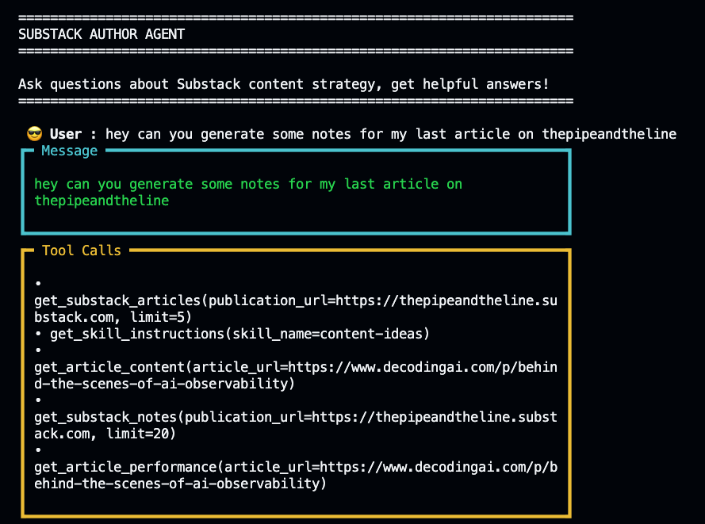
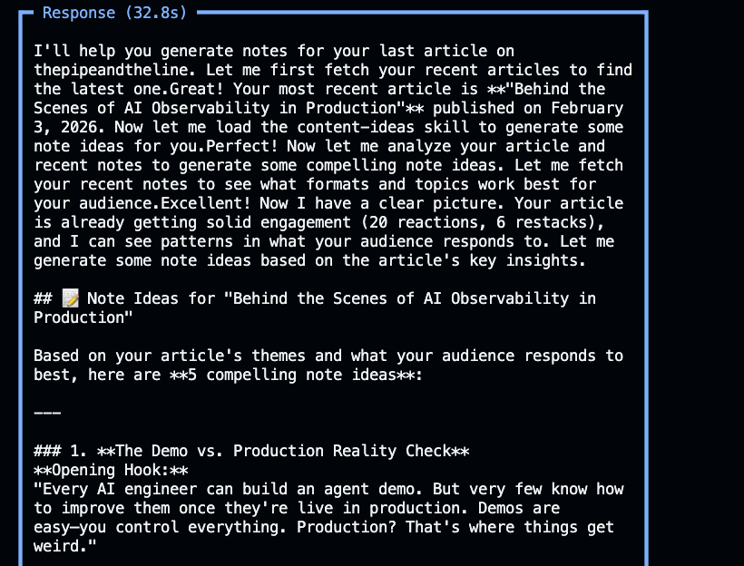
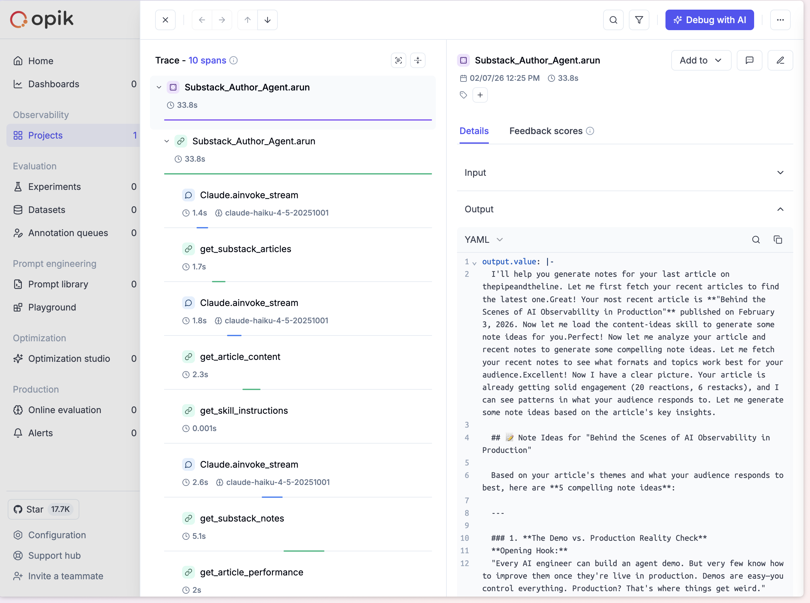
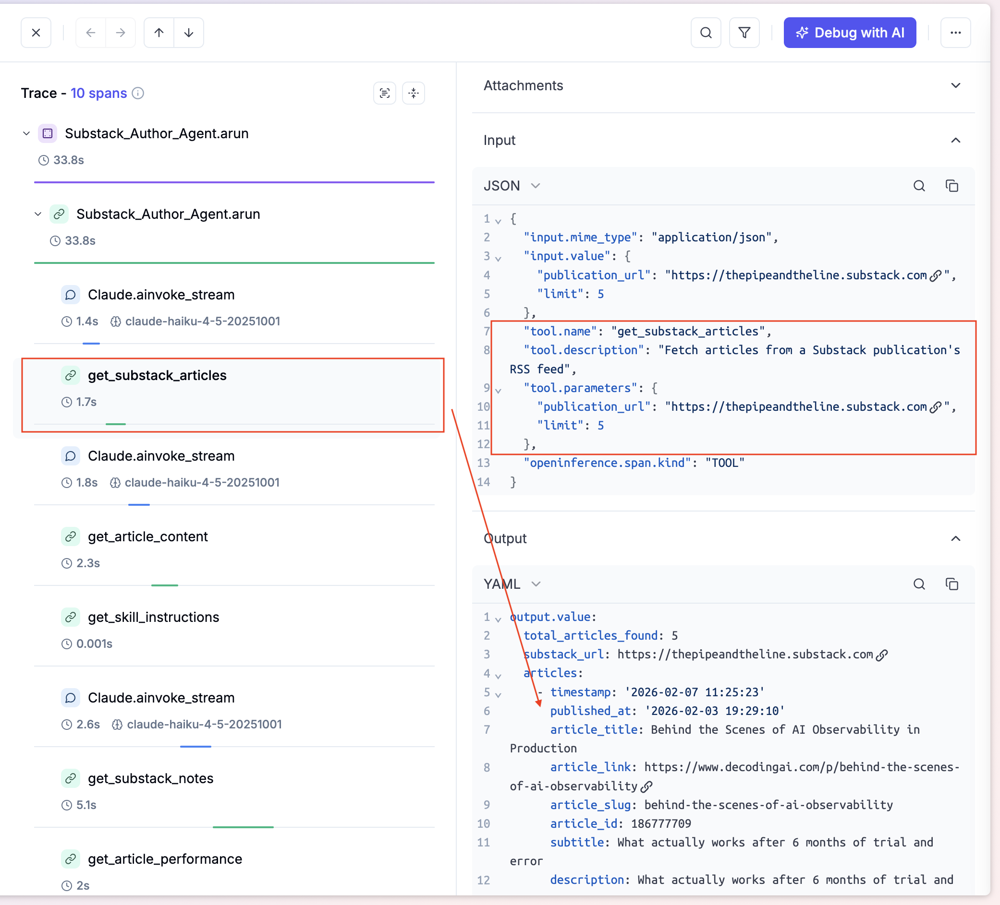
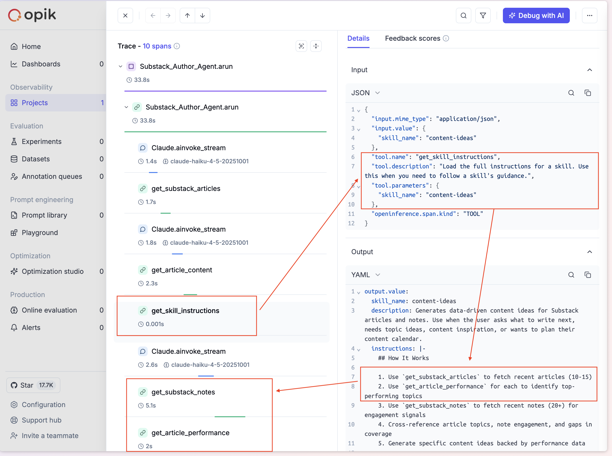

# Substack Author Agent

An [Agno](https://docs.agno.com/) agent that uses MCP tools and Skills to help with Substack content strategy. It connects to the [Substack Author MCP](https://substack-author.fastmcp.app/mcp) server for data, uses Skills for domain expertise, tracks behavior with [Opik](https://www.comet.com/site/products/opik/), and can be exposed as an MCP server itself via AgentOS.

## Stack

| Component | What | Why |
|-----------|------|-----|
| [Agno](https://docs.agno.com/) | Agent framework | Skills, MCPTools, AgentOS, CLI app |
| [Claude Haiku 4.5](https://docs.anthropic.com/en/docs/about-claude/models) | LLM | Fast + cheap for tool orchestration |
| [Substack Author MCP](https://github.com/aboyalejandro/substack-author-mcp) | Remote MCP server | Articles, notes, comments, performance data |
| [Opik + OpenTelemetry](https://www.comet.com/docs/opik/integrations/agno) | Observability | Trace every agent run, tool call, and skill activation |
| [AgentOS](https://docs.agno.com/agent-os/mcp/mcp) | MCP wrapper | Expose the agent as an MCP server |

## Skills

The agent loads 5 skills from `skills/` that guide its behavior based on what you ask:

| Skill | Trigger | MCP Tools Used |
|-------|---------|----------------|
| `analyze-notes` | "How are my notes doing?" | `get_substack_notes` |
| `analyze-articles` | "What articles worked?" | `get_substack_articles`, `get_article_performance`, `get_article_content` |
| `analyze-comments` | "What are readers saying?" | `get_article_comments` |
| `content-ideas` | "What should I write next?" | `get_substack_articles`, `get_article_performance`, `get_substack_notes` |
| `brand-voice` | "What's my writing style?" | `get_substack_articles`, `get_article_content` |

## Setup

```bash
python3 -m venv venv
source venv/bin/activate
pip install -r requirements.txt

cp .env.example .env
```

Edit `.env`:
```bash
ANTHROPIC_API_KEY=sk-ant-...
OTEL_EXPORTER_OTLP_ENDPOINT=https://www.comet.com/opik/api/v1/private/otel
OTEL_EXPORTER_OTLP_HEADERS=Authorization=<your-opik-api-key>,Comet-Workspace=default,projectName=substack-author-agent
```

## Usage

### CLI Agent

```bash
python agent.py
```

Talk to the agent directly. Ask about your notes, articles, comments, content ideas, or writing voice. It streams responses and keeps conversation history in-memory.

### MCP Server (AgentOS)

```bash
python server.py
```

Exposes the agent at `http://localhost:7777/mcp` with a single `run_agent` tool. Connect it to Claude Code, Cursor, or any MCP client.

## Demo

### Agent CLI

| User Message | Agent Response |
|---|---|
|  |  |

### Opik Observability

| Trace Overview | Tool Calls | Skill Usage |
|---|---|---|
|  |  |  |

## Project Structure

```
substack-author-agent/
├── agent.py              # CLI agent: Skills + MCPTools + Opik
├── server.py             # AgentOS: exposes agent as MCP server
├── requirements.txt
├── .env.example
└── skills/
    ├── analyze-notes/SKILL.md
    ├── analyze-articles/SKILL.md
    ├── analyze-comments/SKILL.md
    ├── content-ideas/SKILL.md
    └── brand-voice/SKILL.md
```

## Resources

- [Agno - Agent with Skills](https://docs.agno.com/skills/overview)
- [Agno - Agent as MCP Server](https://docs.agno.com/agent-os/mcp/mcp#agentos-as-mcp-server)
- [Opik - Agno Integration](https://www.comet.com/docs/opik/integrations/agno)
- [Agent Skills Specification](https://agentskills.io/specification)
